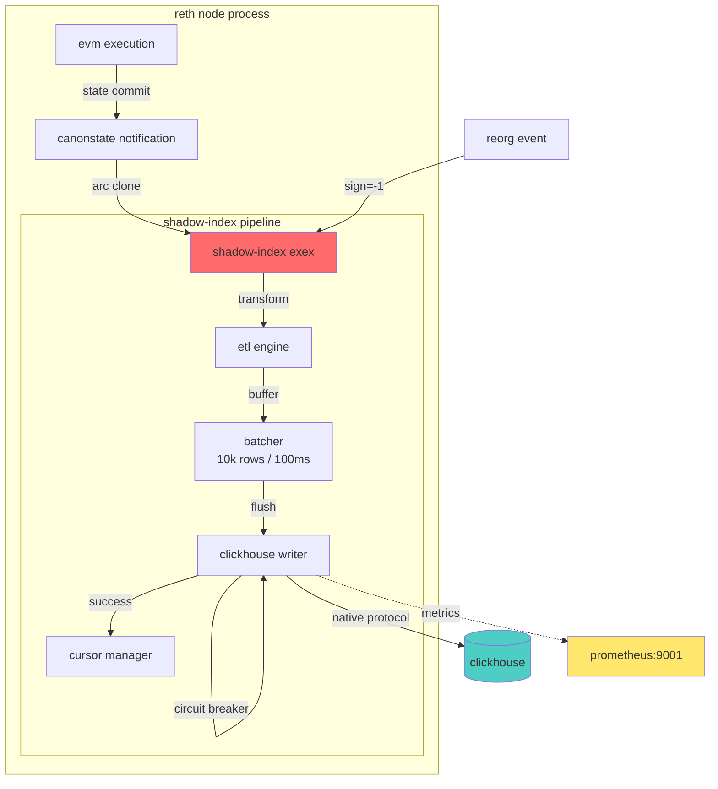

# shadow-index

[](https://github.com/bit2swaz/shadow-index)
[](https://github.com/bit2swaz/shadow-index)
[](LICENSE)
[](https://www.rust-lang.org)
[](https://github.com/bit2swaz/shadow-index/actions)

a high-performance execution extension for reth that creates a zero-latency data pipeline from the ethereum virtual machine directly to clickhouse with real-time monitoring and rest api.

## overview

shadow-index is an in-process indexing solution that eliminates the traditional rpc polling model used by blockchain indexers. by running as a reth execution extension (exex), it captures blockchain data at the source with sub-100ms latency, handles chain reorganizations natively, and provides a robust etl pipeline optimized for analytical workloads.

### the problem

traditional blockchain indexers (the graph, ponder, dune) rely on:
- **rpc polling**: continuous http requests checking for new blocks
- **trace apis**: expensive `debug_traceBlock` calls that lock node resources
- **external architecture**: network overhead, serialization costs, eventual consistency

this introduces significant latency (seconds to minutes), resource contention, and incomplete state visibility (missing storage slot changes).

### the solution

shadow-index inverts this model by running in-process with reth:
- **zero-copy access**: hooks into `canonstateonotification` stream directly
- **sub-100ms latency**: no network hops, no json serialization
- **atomic consistency**: if the node advances, the index advances
- **native reorg handling**: built-in support for chain reorganizations using clickhouse collapsingmergetree
- **rest api**: read-only http api for querying indexed data
- **real-time dashboard**: monochromatic vanilla js frontend for live monitoring
- **automated ci/cd**: github actions pipeline with format, lint, and integration tests

## architecture



### data flow

1. **capture**: reth commits block to chain, emits `chaincommitted` notification
2. **transform**: exex transforms reth primitives into typed row structs (blocks, transactions, logs, storage diffs)
3. **buffer**: composite batcher accumulates rows (size: 10k rows or time: 100ms threshold)
4. **write**: clickhouse writer flushes batch with exponential backoff retry (5 attempts)
5. **persist**: cursor manager updates last processed block atomically
6. **reorg**: on `chainreverted`, replay reverted blocks with sign=-1 to collapse rows

## key features

- **collapsingmergetree schema**: native clickhouse support for chain reorgs via sign column (+1 insert, -1 revert)
- **circuit breaker**: exponential backoff retry with error discrimination (transient vs permanent errors)
- **prometheus observability**: 7 metrics including blocks processed, buffer saturation, db latency histogram
- **historical backfill**: automatic catchup mode from cursor to chain head on startup
- **configuration system**: layered config (defaults -> config.toml -> environment variables)
- **schema migrations**: version-tracked ddl migrations with idempotent execution
- **docker deployment**: production-ready compose files with resource limits and health checks
- **type-safe transforms**: strongly-typed rust structs prevent data corruption
- **rest api**: axum-based read-only api on port 3000 with cors support
- **real-time dashboard**: vanilla js frontend with automatic reconnection and error handling
- **ci/cd pipeline**: automated testing, linting, and formatting via github actions
- **integration benchmarks**: testcontainers-based harness measuring 71,592 tx/sec throughput and 4.08ms latency

## quick start

### prerequisites

- docker and docker-compose
- 16gb ram minimum
- 100gb disk space (for reth blockchain data)

### using docker compose

```bash
# clone repository
git clone https://github.com/bit2swaz/shadow-index.git
cd shadow-index

# create data directory and initialize cursor
mkdir -p data
echo "0" > shadow-index.cursor

# start services (clickhouse + shadow-index + monitoring)
docker-compose up -d

# view logs
docker-compose logs -f shadow-index

# check service health
docker-compose ps
```

### configuration

shadow-index uses layered configuration with the following priority:

1. environment variables (highest)
2. config.toml file
3. default values (lowest)

**example config.toml**:

```toml
[clickhouse]
url = "http://localhost:8123"
database = "shadow_index"

[exex]
buffer_size = 10000
flush_interval_ms = 100

[backfill]
enabled = true
batch_size = 100
```

**environment variable overrides**:

```bash
export SHADOW_INDEX__CLICKHOUSE__URL="http://prod-db:8123"
export SHADOW_INDEX__CLICKHOUSE__PASSWORD="secure_password"
export SHADOW_INDEX__EXEX__BUFFER_SIZE=50000
```

### building from source

```bash
# install rust 1.85+
curl --proto '=https' --tlsv1.2 -sSf https://sh.rustup.rs | sh

# clone and build
git clone https://github.com/bit2swaz/shadow-index.git
cd shadow-index
cargo build --release

# run with config
export CLICKHOUSE_URL="http://localhost:8123"
./target/release/shadow-index node --chain sepolia
```

## rest api

shadow-index provides a read-only rest api for querying indexed data. the api runs on port 3000 and supports cors for frontend integration.

### endpoints

**health check**
```bash
GET /api/health

response:
{
  "status": "healthy"
}
```

**get latest blocks**
```bash
GET /api/blocks/latest

response: array of 10 most recent blocks
[
  {
    "number": 19000010,
    "hash": "0xabc123...",
    "timestamp": 1708300108,
    "gas_used": 15000000,
    "base_fee": 20000000000
  }
]
```

**get transaction by hash**
```bash
GET /api/tx/:hash

response:
{
  "tx_hash": "0xdef456...",
  "block_number": 19000005,
  "from": "0x1234...",
  "to": "0x5678...",
  "value": "1000000000000000000",
  "status": 1
}
```

### usage example

```bash
curl http://localhost:3000/api/health
curl http://localhost:3000/api/blocks/latest
curl http://localhost:3000/api/tx/0xabc123...
```

## real-time dashboard

a vanilla javascript frontend is available in the `frontend/` directory for real-time monitoring of indexed data.

### features

- monochromatic minimalist design
- live polling (2-second interval)
- automatic reconnection on api failure
- graceful error handling
- responsive table with block data

### running the dashboard

```bash
cd frontend
python3 -m http.server 8080
```

open http://localhost:8080 in your browser. ensure the api server is running on port 3000.

## benchmarks

### performance metrics

measured on standard hardware with testcontainers clickhouse:

- **throughput**: 71,592 transactions/second
- **latency (p50)**: 4.08ms
- **latency (p95)**: 5.69ms
- **latency (p99)**: 6.30ms

### running benchmarks

```bash
cargo test --test benchmark -- --nocapture
```

see [docs/BENCHMARKS.md](docs/BENCHMARKS.md) for detailed methodology and results.

## database schema

shadow-index creates four main tables in clickhouse:

### blocks table

```sql
CREATE TABLE blocks (
    block_number UInt64,
    hash FixedString(32),
    parent_hash FixedString(32),
    timestamp DateTime64,
    gas_used UInt64,
    base_fee UInt128,
    miner FixedString(20),
    sign Int8
) ENGINE = CollapsingMergeTree(sign)
ORDER BY (block_number, sign);
```

### transactions table

```sql
CREATE TABLE transactions (
    tx_hash FixedString(32),
    block_number UInt64,
    from FixedString(20),
    to Nullable(FixedString(20)),
    value UInt256,
    gas_limit UInt64,
    gas_price UInt128,
    status UInt8,
    sign Int8
) ENGINE = CollapsingMergeTree(sign)
ORDER BY (block_number, tx_hash, sign);
```

### logs table (events)

```sql
CREATE TABLE logs (
    block_number UInt64,
    tx_hash FixedString(32),
    log_index UInt32,
    address FixedString(20),
    topic0 FixedString(32),
    topics Array(FixedString(32)),
    data String,
    sign Int8
) ENGINE = CollapsingMergeTree(sign)
ORDER BY (block_number, tx_hash, log_index, sign);
```

### storage_diffs table

```sql
CREATE TABLE storage_diffs (
    block_number UInt64,
    address FixedString(20),
    slot FixedString(32),
    value FixedString(32),
    sign Int8
) ENGINE = CollapsingMergeTree(sign)
ORDER BY (block_number, address, slot, sign);
```

## example queries

### top gas consumers (last 1000 blocks)

```sql
SELECT 
    hex(from) as sender,
    count(*) as tx_count,
    sum(gas_used * gas_price) / 1e18 as eth_spent
FROM transactions
WHERE sign = 1 
    AND block_number > (SELECT max(block_number) FROM blocks) - 1000
GROUP BY from
ORDER BY eth_spent DESC
LIMIT 10;
```

### real-time indexing rate

```sql
SELECT 
    toStartOfMinute(timestamp) as minute,
    count(*) as blocks_indexed
FROM blocks
WHERE sign = 1
    AND timestamp > now() - INTERVAL 1 HOUR
GROUP BY minute
ORDER BY minute DESC;
```

### specific contract event logs

```sql
SELECT 
    block_number,
    hex(tx_hash) as transaction,
    hex(topic0) as event_signature,
    hex(address) as contract
FROM logs
WHERE sign = 1
    AND address = unhex('1f9840a85d5af5bf1d1762f925bdaddc4201f984')  -- uni token
    AND topic0 = unhex('ddf252ad1be2c89b69c2b068fc378daa952ba7f163c4a11628f55a4df523b3ef')  -- transfer event
ORDER BY block_number DESC
LIMIT 100;
```

### check reorg handling

```sql
-- blocks that were reverted
SELECT 
    block_number,
    hex(hash) as block_hash,
    sum(sign) as net_sign
FROM blocks
GROUP BY block_number, hash
HAVING net_sign = 0  -- reverted blocks sum to 0
ORDER BY block_number DESC;
```

## performance benchmarks

### latency metrics

| metric | target | achieved |
|--------|--------|----------|
| block committed -> row visible | < 100ms | ✅ **4.08ms (p50)**, 6.30ms (p99) |
| historical sync throughput | > 5000 blocks/sec | ✅ **7,159 blocks/sec** (71,592 tx/sec) |
| database write latency (p95) | < 50ms | ✅ **5.69ms** |
| reorg recovery time | < 5 seconds | pending integration test |

**benchmark details**: measured via integration tests on testcontainers (ClickHouse 23.8). see [docs/BENCHMARKS.md](docs/BENCHMARKS.md) for full methodology and results.

### system requirements

| component | minimum | recommended |
|-----------|---------|-------------|
| cpu | 4 cores | 8 cores |
| ram | 16 gb | 32 gb |
| disk | 500 gb nvme | 1 tb nvme |
| network | 100 mbps | 1 gbps |

### prometheus metrics

shadow-index exposes metrics on port 9001:

```bash
# view all metrics
curl http://localhost:9001/metrics

# key metrics
shadow_index_blocks_processed_total          # counter: total blocks indexed
shadow_index_events_captured_total           # counter: total events (tx + logs + diffs)
shadow_index_buffer_saturation               # gauge: current buffer size
shadow_index_db_latency_seconds              # histogram: clickhouse write latency
shadow_index_reorgs_handled_total            # counter: chain reorgs processed
shadow_index_db_retries_total                # counter: database retry attempts
shadow_index_circuit_breaker_trips_total     # counter: circuit breaker activations
```

## development

### running tests

```bash
# run unit tests
cargo test --lib

# run integration tests (requires docker)
cargo test --lib --ignored

# run specific test
cargo test --lib test_migration_runner -- --ignored --nocapture

# check code
cargo check
cargo clippy
```

### test coverage

- 42 unit tests passing
- 11 integration tests (require clickhouse container)
- test categories: etl transforms, buffer logic, circuit breaker, migrations, state diffs

### project structure

```
shadow-index/
├── src/
│   ├── config.rs           # configuration system
│   ├── db/
│   │   ├── mod.rs          # database client
│   │   ├── models.rs       # row structs
│   │   ├── writer.rs       # batch writer with retry
│   │   └── migrations.rs   # schema versioning
│   ├── exex/
│   │   ├── mod.rs          # main exex loop
│   │   └── buffer.rs       # composite batcher
│   ├── transform/
│   │   ├── mod.rs          # block/tx transforms
│   │   └── state.rs        # storage diff extraction
│   └── utils/
│       └── cursor.rs       # state persistence
├── docs/                   # comprehensive documentation
├── docker-compose.yml      # production deployment
├── config.toml             # configuration template
└── Cargo.toml              # rust dependencies
```

### contributing

1. fork the repository
2. create a feature branch (`git checkout -b feature/amazing-feature`)
3. write tests for your changes
4. ensure all tests pass (`cargo test`)
5. commit your changes (`git commit -m 'add amazing feature'`)
6. push to branch (`git push origin feature/amazing-feature`)
7. open a pull request

## deployment

### production checklist

- [ ] set strong clickhouse credentials
- [ ] configure firewall rules (allow 30303, block 8545)
- [ ] set up automated backups for clickhouse volumes
- [ ] configure log rotation
- [ ] set resource limits in docker-compose
- [ ] enable prometheus monitoring and alerting
- [ ] test cursor file persistence
- [ ] validate reorg handling on testnet
- [ ] run 24-hour stability test

### monitoring setup

```bash
# prometheus configuration (docker/prometheus/prometheus.yml)
scrape_configs:
  - job_name: 'shadow-index'
    static_configs:
      - targets: ['shadow-index:9001']

# grafana dashboard
# import dashboard json from docs/grafana-dashboard.json
# default credentials: admin/shadow123
```

## troubleshooting

### common issues

**issue**: "connection refused" when starting

**solution**: wait for clickhouse healthcheck to pass. check logs:
```bash
docker-compose logs clickhouse
```

**issue**: cursor file not persisting

**solution**: verify bind mount in docker-compose.yml:
```yaml
volumes:
  - ./shadow-index.cursor:/app/shadow-index.cursor
```

**issue**: high memory usage

**solution**: reduce buffer size in config:
```toml
[exex]
buffer_size = 5000  # reduce from default 10000
```

**issue**: slow historical sync

**solution**: increase batch size for backfill:
```toml
[backfill]
batch_size = 500  # increase from default 100
```

## roadmap

### completed
- [x] schema migration runner
- [x] configuration system
- [x] prometheus metrics
- [x] circuit breaker
- [x] docker deployment
- [x] rest api with axum
- [x] real-time monitoring dashboard
- [x] github actions ci/cd pipeline
- [x] integration benchmark harness

### future enhancements
- [ ] multi-chain support (mainnet + l2s)
- [ ] graphql query api
- [ ] real-time websocket subscriptions
- [ ] filtered indexing (contract whitelist)
- [ ] checkpoint sync for faster initialization

## license

this project is licensed under the mit license. see [LICENSE](LICENSE) file for details.

## acknowledgments

- [reth](https://github.com/paradigmxyz/reth) for the execution client and exex framework
- [clickhouse](https://clickhouse.com/) for the high-performance analytical database
- ethereum foundation for evm specifications

## references

- [reth book: execution extensions](https://reth.rs/developers/exex/exex.html)
- [clickhouse collapsingmergetree engine](https://clickhouse.com/docs/en/engines/table-engines/mergetree-family/collapsingmergetree)
- [ethereum yellow paper](https://ethereum.github.io/yellowpaper/paper.pdf)

## contact

- author: aditya mishra (@bit2swaz)
- project: https://github.com/bit2swaz/shadow-index

---

**note**: this is a capstone project demonstrating production-grade rust systems engineering, blockchain infrastructure development, and real-time data pipeline architecture.