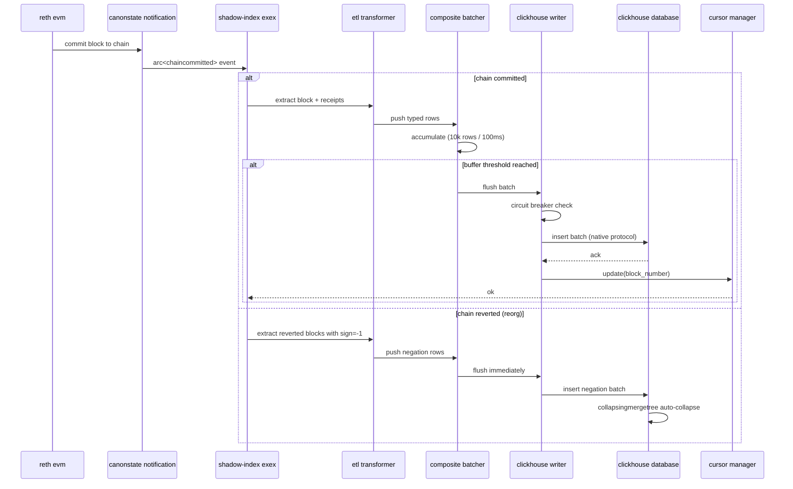
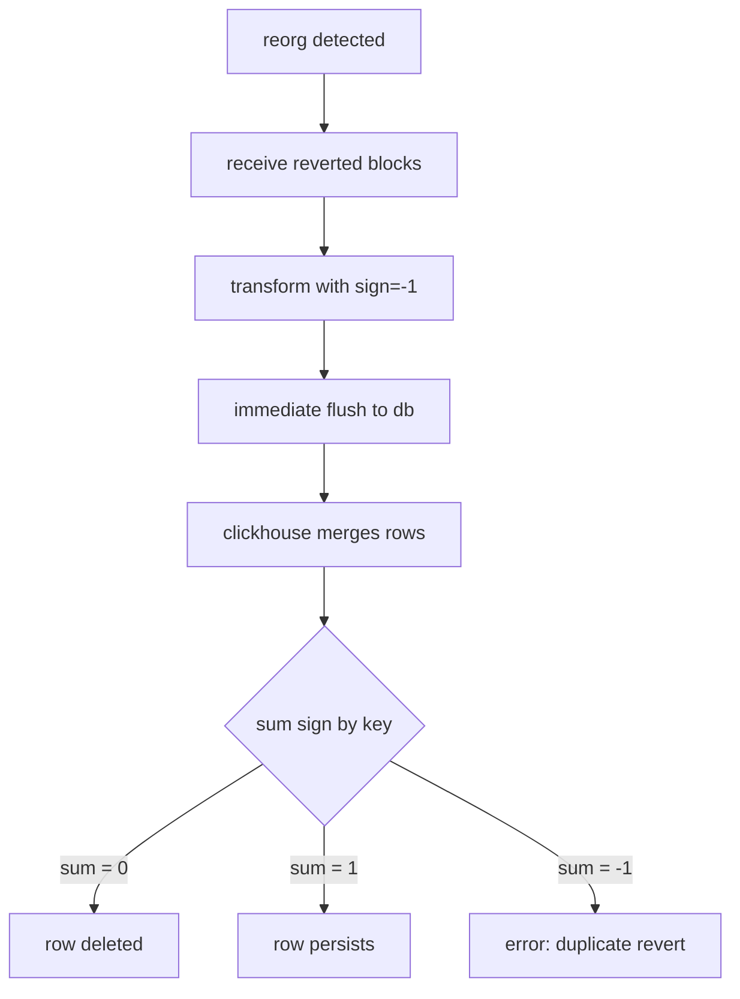

# architecture

comprehensive system design and implementation details for shadow-index.

## table of contents

- [overview](#overview)
- [data flow pipeline](#data-flow-pipeline)
- [core components](#core-components)
- [database schema design](#database-schema-design)
- [reorg handling](#reorg-handling)
- [state persistence](#state-persistence)
- [concurrency model](#concurrency-model)

## overview

shadow-index is architected as a reth execution extension (exex) that runs in-process with the ethereum client. this design eliminates the traditional rpc polling architecture used by external indexers, providing direct access to committed state changes with zero serialization overhead.

### architectural principles

1. **zero-copy data access**: direct memory access to reth's committed state
2. **atomic consistency**: database state mirrors node state exactly
3. **crash resilience**: cursor-based checkpointing enables instant recovery
4. **horizontal scalability**: stateless transform layer allows parallel processing
5. **operational simplicity**: single binary deployment with embedded monitoring

## data flow pipeline



### event capture

the entry point is the `ShadowExEx` struct implementing the `ExExContext` trait:

```rust
pub struct ShadowExEx {
    ctx: ExExContext<Node>,
    writer: ClickHouseWriter,
    cursor: CursorManager,
    batcher: Batcher,
}

impl Future for ShadowExEx {
    async fn poll(self: Pin<&mut Self>, cx: &mut Context) -> Poll<Result<()>> {
        while let Some(notification) = self.ctx.notifications.recv().await {
            match notification {
                CanonStateNotification::Commit { new } => {
                    self.handle_commit(new).await?;
                }
                CanonStateNotification::Revert { old } => {
                    self.handle_revert(old).await?;
                }
            }
        }
    }
}
```

### key design decisions

**q: why run in-process instead of as a separate indexer?**

a: in-process execution provides:
- **latency reduction**: zero network hops, zero json serialization
- **resource efficiency**: no duplicate state storage, shared memory pool
- **consistency guarantee**: if node advances, index advances atomically
- **failure domain**: single service to monitor and restart

**q: why use arc-based notification instead of callback?**

a: reth's exex framework uses arc cloning to fan out notifications to multiple extensions. this allows:
- **concurrent processing**: multiple exexs can process the same block independently
- **backpressure handling**: slow exexs don't block fast ones
- **zero-copy sharing**: block data is reference-counted, not copied

## core components

### 1. shadow exex (orchestrator)

**location**: `src/exex/mod.rs`

**responsibilities**:
- receive `CanonStateNotification` stream from reth
- dispatch commit/revert events to appropriate handlers
- coordinate backfill mode for historical catchup
- emit prometheus metrics for observability

**key methods**:

```rust
async fn handle_commit(&mut self, chain: Arc<Chain>) -> Result<()> {
    for block in chain.blocks() {
        let rows = transform_block(block)?;
        self.batcher.push(rows);
        
        if self.batcher.should_flush() {
            self.flush_batch().await?;
        }
        
        counter!("shadow_index_blocks_processed_total").increment(1);
    }
    Ok(())
}

async fn handle_revert(&mut self, chain: Arc<Chain>) -> Result<()> {
    for block in chain.blocks().iter().rev() {
        let rows = transform_block_with_sign(block, -1)?;
        self.batcher.push(rows);
    }
    // immediate flush to ensure reorg atomicity
    self.flush_batch().await?;
    Ok(())
}
```

### 2. etl transformer

**location**: `src/transform/mod.rs`

**responsibilities**:
- convert reth primitives (`SealedBlock`, `Receipt`) to typed row structs
- extract storage diffs from state changes
- normalize addresses and hashes to fixed-size byte arrays
- apply `sign` column for collapsingmergetree compatibility

**input types**:
- `reth_primitives::SealedBlock`
- `reth_primitives::Receipt`
- `reth_execution_types::ExecutionOutcome`

**output types**:
- `BlockRow`: block metadata with gas metrics
- `TransactionRow`: tx data with from/to/value
- `LogRow`: event logs with topics array
- `StorageDiffRow`: state slot changes with address/slot/value

**transformation logic**:

```rust
pub fn transform_block(block: &SealedBlock, receipts: &[Receipt], sign: i8) -> TransformResult {
    let block_row = BlockRow {
        block_number: block.number,
        hash: block.hash().0,
        parent_hash: block.parent_hash.0,
        timestamp: block.timestamp,
        gas_used: block.gas_used,
        base_fee: block.base_fee_per_gas.unwrap_or_default(),
        miner: block.beneficiary.0,
        sign,
    };
    
    let tx_rows: Vec<TransactionRow> = block.body.iter()
        .zip(receipts)
        .map(|(tx, receipt)| TransactionRow {
            tx_hash: tx.hash().0,
            block_number: block.number,
            from: tx.recover_signer().unwrap().0,
            to: tx.to().map(|addr| addr.0),
            value: tx.value(),
            gas_limit: tx.gas_limit(),
            gas_price: tx.effective_gas_price(block.base_fee_per_gas),
            status: receipt.success as u8,
            sign,
        })
        .collect();
    
    let log_rows: Vec<LogRow> = receipts.iter()
        .flat_map(|r| &r.logs)
        .enumerate()
        .map(|(idx, log)| LogRow {
            block_number: block.number,
            tx_hash: log.transaction_hash.0,
            log_index: idx as u32,
            address: log.address.0,
            topic0: log.topics.get(0).map(|t| t.0).unwrap_or_default(),
            topics: log.topics.iter().map(|t| t.0.to_vec()).collect(),
            data: log.data.to_vec(),
            sign,
        })
        .collect();
    
    TransformResult { block_row, tx_rows, log_rows }
}
```

### 3. composite batcher

**location**: `src/exex/buffer.rs`

**responsibilities**:
- accumulate rows from multiple blocks before flushing
- enforce size threshold (default: 10,000 rows) and time threshold (default: 100ms)
- track buffer saturation for backpressure metrics
- provide typed access to each table's pending rows

**flush conditions**:

```rust
pub fn should_flush(&self) -> bool {
    let size_exceeded = self.total_rows() >= self.size_threshold;
    let time_exceeded = self.last_flush.elapsed() >= self.time_threshold;
    
    size_exceeded || time_exceeded
}
```

**memory efficiency**: uses `Vec` with pre-allocated capacity to minimize reallocations:

```rust
pub struct Batcher {
    blocks: Vec<BlockRow>,
    transactions: Vec<TransactionRow>,
    logs: Vec<LogRow>,
    storage_diffs: Vec<StorageDiffRow>,
    
    size_threshold: usize,
    time_threshold: Duration,
    last_flush: Instant,
}

impl Batcher {
    pub fn with_thresholds(size_threshold: usize, time_threshold: Duration) -> Self {
        Self {
            blocks: Vec::with_capacity(size_threshold / 100),
            transactions: Vec::with_capacity(size_threshold / 10),
            logs: Vec::with_capacity(size_threshold / 5),
            storage_diffs: Vec::with_capacity(size_threshold / 2),
            size_threshold,
            time_threshold,
            last_flush: Instant::now(),
        }
    }
}
```

### 4. clickhouse writer

**location**: `src/db/writer.rs`

**responsibilities**:
- manage clickhouse client connection pool
- execute batch inserts using native tcp protocol
- implement circuit breaker with exponential backoff retry
- discriminate between transient and permanent errors
- emit latency histograms for monitoring

**circuit breaker logic**:

```rust
const MAX_ATTEMPTS: usize = 5;
const BASE_DELAY: Duration = Duration::from_secs(1);

pub async fn insert_batch<T>(&self, table: &str, rows: &[T]) -> Result<()> 
where
    T: Serialize,
{
    for attempt in 1..=MAX_ATTEMPTS {
        let start = Instant::now();
        
        match self.try_insert_batch(table, rows).await {
            Ok(_) => {
                histogram!("shadow_index_db_latency_seconds")
                    .record(start.elapsed().as_secs_f64());
                return Ok(());
            }
            Err(e) if !Self::is_retryable_error(&e) => {
                // permanent error (syntax, permission, schema mismatch)
                return Err(e);
            }
            Err(e) => {
                counter!("shadow_index_db_retries_total").increment(1);
                let delay = BASE_DELAY * 2_u32.pow(attempt as u32 - 1);
                
                tracing::warn!(
                    attempt = attempt,
                    delay_ms = delay.as_millis(),
                    error = %e,
                    "clickhouse write failed, retrying"
                );
                
                tokio::time::sleep(delay).await;
            }
        }
    }
    
    counter!("shadow_index_circuit_breaker_trips_total").increment(1);
    Err(eyre!("circuit breaker open: clickhouse unreachable after {} attempts", MAX_ATTEMPTS))
}
```

**error discrimination**:

```rust
fn is_retryable_error(error: &eyre::Report) -> bool {
    let error_string = format!("{:?}", error);
    
    // permanent errors (schema/permission/syntax)
    if error_string.contains("Code: 516")  // authentication failed
        || error_string.contains("Code: 62")  // syntax error
        || error_string.contains("Code: 60")  // table doesn't exist
        || error_string.contains("Code: 81")  // database doesn't exist
    {
        return false;
    }
    
    // transient errors (network/resource)
    error_string.contains("timeout")
        || error_string.contains("connection refused")
        || error_string.contains("503")
        || error_string.contains("502")
}
```

## database schema design

### collapsingmergetree engine

shadow-index uses clickhouse's `CollapsingMergeTree` table engine, which natively supports data mutations through sign-based row collapsing.

**how it works**:

1. every row has a `sign` column (1 or -1)
2. when inserting a block: set `sign = 1`
3. when reverting a block: insert the same row with `sign = -1`
4. during background merge, clickhouse sums rows by primary key
5. if sum = 0, the row is deleted (cancelled out)
6. if sum = 1, the row persists (net positive)

**advantages over traditional upsert**:

| approach | reorg handling | query complexity | write amplification |
|----------|----------------|------------------|---------------------|
| delete + insert | explicit delete queries | simple | high (2x writes) |
| upsert/replace | requires unique keys | simple | medium |
| collapsingmergetree | automatic collapse | requires sum(sign) | low (single insert) |

**example schema**:

```sql
CREATE TABLE blocks (
    block_number UInt64,
    hash FixedString(32),
    parent_hash FixedString(32),
    timestamp DateTime64(3),
    gas_used UInt64,
    gas_limit UInt64,
    base_fee UInt128,
    miner FixedString(20),
    sign Int8
)
ENGINE = CollapsingMergeTree(sign)
ORDER BY (block_number, hash, sign);
```

**querying with sign**:

```sql
-- correct: include sign filter
SELECT count(*) FROM blocks WHERE sign = 1;

-- correct: use sum(sign) for aggregates
SELECT block_number, sum(sign) as net
FROM blocks
GROUP BY block_number
HAVING net > 0;

-- incorrect: ignoring sign gives duplicate rows
SELECT count(*) FROM blocks;  -- will overcount during reorgs
```

### primary key design

each table uses a composite primary key optimized for common query patterns:

**blocks table**: `ORDER BY (block_number, hash, sign)`
- enables fast range scans by block height
- hash discriminates reorged blocks at same height
- sign ensures collapse correctness

**transactions table**: `ORDER BY (block_number, tx_hash, sign)`
- supports block-level transaction lookups
- enables tx hash-based point queries
- maintains temporal ordering

**logs table**: `ORDER BY (block_number, tx_hash, log_index, sign)`
- optimizes event log queries by block range
- supports transaction-scoped log retrieval
- log_index provides stable ordering

**storage_diffs table**: `ORDER BY (block_number, address, slot, sign)`
- enables contract state history queries
- supports slot-specific diff tracking
- address indexing for account-scoped queries

### data type choices

**addresses**: `FixedString(20)`
- ethereum addresses are exactly 20 bytes
- fixed size enables better compression and index performance
- stored as raw bytes (not hex-encoded)

**hashes**: `FixedString(32)`
- block hashes and tx hashes are exactly 32 bytes (keccak256 output)
- avoids varchar overhead

**balances/values**: `UInt256`
- native 256-bit integer support
- preserves precision for wei amounts
- no floating-point rounding errors

**timestamps**: `DateTime64(3)`
- millisecond precision
- supports ethereum's 1-second block times
- enables sub-second query aggregations

## reorg handling

### reorg detection

reth emits `CanonStateNotification::Revert` when a chain reorganization occurs:

```rust
pub enum CanonStateNotification {
    Commit { new: Arc<Chain> },
    Revert { old: Arc<Chain> },
}
```

the `Revert` variant contains the blocks that were removed from the canonical chain. shadow-index processes these blocks in reverse order with `sign = -1`.

### reorg processing flow



### example reorg scenario

**initial state**: blocks 1000-1002 are canonical

```
block 1000: sign=1
block 1001: sign=1
block 1002: sign=1
```

**reorg event**: blocks 1001-1002 reverted, new fork chain added

```
insert block 1001: sign=-1
insert block 1002: sign=-1
insert block 1001': sign=1  (new fork block)
insert block 1002': sign=1  (new fork block)
```

**final state after merge**:

```
block 1000: sum(sign)=1  -> persists
block 1001: sum(sign)=0  -> deleted (1 + -1)
block 1002: sum(sign)=0  -> deleted (1 + -1)
block 1001': sum(sign)=1 -> persists (new fork)
block 1002': sum(sign)=1 -> persists (new fork)
```

### reorg depth limits

shadow-index does not impose artificial reorg depth limits. the system can handle:
- **shallow reorgs** (1-3 blocks): common during normal operation
- **deep reorgs** (100+ blocks): testnets or consensus failures
- **total chain rewrites**: genesis replay with cursor reset

## state persistence

### cursor manager

**location**: `src/utils/cursor.rs`

the cursor manager maintains a local file storing the last successfully processed block number.

**persistence guarantees**:

```rust
pub struct CursorManager {
    path: PathBuf,
    current: AtomicU64,
}

impl CursorManager {
    pub async fn update(&self, block_number: u64) -> Result<()> {
        // atomic file write with fsync
        let tmp_path = self.path.with_extension("tmp");
        fs::write(&tmp_path, block_number.to_string()).await?;
        fs::rename(tmp_path, &self.path).await?;
        
        // update in-memory cache
        self.current.store(block_number, Ordering::SeqCst);
        Ok(())
    }
    
    pub fn get(&self) -> u64 {
        self.current.load(Ordering::SeqCst)
    }
}
```

**crash recovery**:

1. on startup, read cursor file (default: `shadow-index.cursor`)
2. if file missing, start from genesis (block 0)
3. if file present, resume from `cursor_block + 1`
4. reth exex framework handles catchup via backfill mode

**atomicity**: cursor is updated only after successful database flush. this ensures:
- **no data loss**: crash before cursor update = reprocess block (idempotent)
- **no gaps**: cursor always points to last committed block
- **instant recovery**: restart resumes from exact checkpoint

### backfill mode

when the cursor lags behind chain head, shadow-index enters backfill mode:

```rust
async fn backfill(&mut self, from: u64, to: u64) -> Result<()> {
    let batch_size = self.config.backfill.batch_size;
    
    for chunk_start in (from..=to).step_by(batch_size) {
        let chunk_end = (chunk_start + batch_size as u64).min(to);
        
        let blocks = self.provider.block_range(chunk_start..=chunk_end)?;
        
        for block in blocks {
            self.handle_commit(Arc::new(Chain::new(vec![block]))).await?;
        }
        
        tracing::info!(
            progress = chunk_end,
            total = to,
            "backfill progress: {:.1}%",
            (chunk_end - from) as f64 / (to - from) as f64 * 100.0
        );
    }
    
    Ok(())
}
```

## concurrency model

### single-threaded execution

shadow-index uses tokio's async runtime but processes blocks sequentially within a single task. this design choice ensures:

1. **ordering guarantee**: blocks are processed in canonical order
2. **consistency**: no race conditions between commit and revert handlers
3. **simplicity**: no complex locking or synchronization primitives

### async io parallelism

while block processing is sequential, io operations (database writes, cursor updates) are concurrent:

```rust
// buffer flush uses tokio::spawn for parallel table inserts
async fn flush_batch(&mut self) -> Result<()> {
    let (blocks, txs, logs, diffs) = self.batcher.take_all();
    
    let handles = vec![
        tokio::spawn(self.writer.clone().insert_batch("blocks", blocks)),
        tokio::spawn(self.writer.clone().insert_batch("transactions", txs)),
        tokio::spawn(self.writer.clone().insert_batch("logs", logs)),
        tokio::spawn(self.writer.clone().insert_batch("storage_diffs", diffs)),
    ];
    
    // wait for all inserts to complete
    for handle in handles {
        handle.await??;
    }
    
    Ok(())
}
```

### backpressure handling

if the database cannot keep up with block production:

1. **buffer fills**: batcher accumulates rows until threshold
2. **flush blocks**: exex awaits database ack before processing next block
3. **reth pauses**: exex backpressure propagates to reth's notification channel
4. **chain sync slows**: reth reduces peer sync rate to match exex capacity

this creates a natural flow control mechanism without explicit rate limiting.

## observability

shadow-index exposes prometheus metrics on port 9001:

```rust
// counters
counter!("shadow_index_blocks_processed_total").increment(1);
counter!("shadow_index_events_captured_total").increment(log_count);
counter!("shadow_index_reorgs_handled_total").increment(1);
counter!("shadow_index_db_retries_total").increment(1);
counter!("shadow_index_circuit_breaker_trips_total").increment(1);

// gauges
gauge!("shadow_index_buffer_saturation").set(self.batcher.total_rows() as f64);

// histograms
histogram!("shadow_index_db_latency_seconds").record(elapsed.as_secs_f64());
```

these metrics enable real-time monitoring of:
- **indexing rate**: blocks/sec throughput
- **data capture**: events/logs indexed per block
- **system health**: retry attempts, circuit breaker trips
- **latency**: p50/p95/p99 database write times

## performance characteristics

### memory usage

**typical operation** (1000 blocks buffered):
- batcher: ~10mb (10k rows x 1kb avg row size)
- reth notification queue: ~50mb (50 blocks x 1mb block size)
- clickhouse client: ~5mb (connection pool overhead)
- **total**: ~65mb

**peak operation** (historical backfill):
- can spike to 200mb during rapid catchup
- gc pressure minimal due to batch clearing

### cpu utilization

- **steady state**: 5-10% of single core (mostly idle waiting for blocks)
- **backfill mode**: 40-60% of single core (transform-heavy)
- **clickhouse writes**: handled by separate server process

### disk io

- **cursor writes**: 1 fsync per block (negligible overhead)
- **database writes**: batched, delegated to clickhouse server
- **log output**: structured json logs via tracing

## future optimizations

potential areas for performance improvement:

1. **parallel block processing**: process independent blocks concurrently (requires ordering buffer)
2. **compression**: enable lz4 compression on clickhouse inserts
3. **partition pruning**: split tables by date ranges for faster queries
4. **materialized views**: pre-compute common aggregations (daily tx counts, top contracts)
5. **zero-copy transforms**: use reth's view types to avoid cloning block data

---

**last updated**: february 2026  
**version**: 1.0.0-rc1
